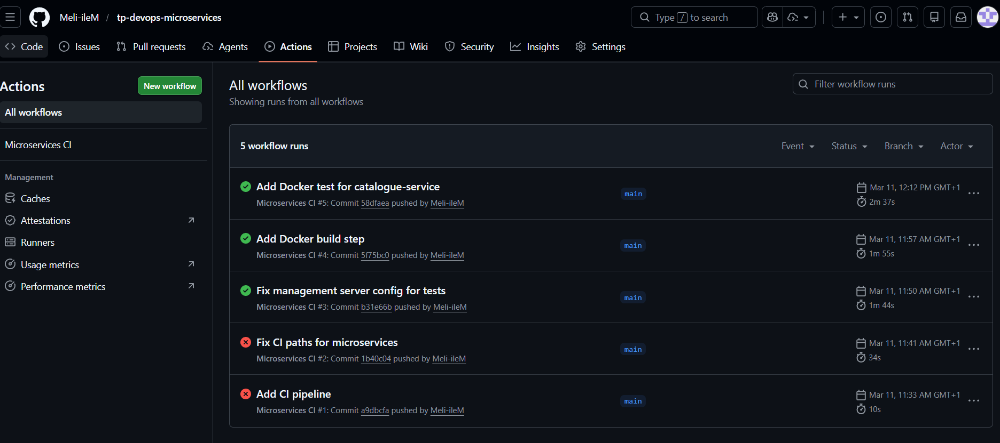

# Rapport de TP : DevOps Microservices

## Présentation

Ce projet est une application e-commerce basée sur une architecture micro-services, réalisée dans le cadre du TP "Techniques de conteneurisation et micro-services". L’objectif est de concevoir, développer et déployer plusieurs micro-services Spring Boot, conteneurisés avec Docker et orchestrés avec Docker Compose.

## Micro-services inclus

- **catalogue-service** : Gestion des produits
- **commande-service** : Gestion des commandes
- **paiement-service** : Gestion des paiements
- **gateway-service** : API Gateway pour centraliser les accès
- **discovery-service** : Service de découverte Eureka
- **config-service** : Service de configuration centralisée

## Étapes réalisées

1. **Préparation de l’environnement**
	- Installation des outils (IDE, JDK, Maven, Docker)
	- Configuration des variables d’environnement

2. **Génération des projets**
	- Création des micro-services via Spring Initializr avec les dépendances nécessaires

3. **Développement**
	- Implémentation des REST APIs, gestion des erreurs, logging, validation, mapping DTO, tests unitaires
	- Communication inter-services via OpenFeign

4. **Conteneurisation**
	- Création d’un Dockerfile pour chaque micro-service
	- Compilation et création des images Docker

5. **Déploiement local**
	- Lancement des conteneurs individuellement avec Docker
	- Orchestration complète avec Docker Compose (`docker-compose.yml`)
	- Configuration des ports, variables d’environnement, dépendances, réseau interne

6. **Tests et validation**
	- Vérification de l’enregistrement des micro-services dans Eureka
	- Tests des appels via la Gateway
	- Consultation des logs
	- Ajout de bases de données et healthchecks

## CI/CD avec GitHub Actions

Nous avons mis en place une action GitHub pour automatiser l’intégration continue (CI) du projet. Cette action vérifie la compilation, les tests et la qualité du code à chaque push.

**Résultat :** L’action GitHub s’est exécutée avec succès, validant l’ensemble du pipeline CI.

### Capture d’écran de la réussite



*(La capture d’écran est disponible dans le dossier `images/` sous le nom `github-action-success.png`)*

## Test du Dockerfile.test

Un fichier `Dockerfile.test` a été créé pour tester le micro-service `catalogue-service` dans un environnement conteneurisé. Ce test permet de valider le fonctionnement du service dans un conteneur Docker dédié aux tests.

**Exemple de commande pour lancer le test :**

```
docker build -f Dockerfile.test -t catalogue-service-test .
docker run catalogue-service-test
```

## Commandes utiles

- Compilation Maven :
  ```
  mvn clean package
  ```
- Construction des images Docker :
  ```
  docker build -t <service>:1.0 .
  ```
- Lancement des conteneurs :
  ```
  docker run -p <port>:8080 <service>:1.0
  ```
- Orchestration avec Docker Compose :
  ```
  docker compose up
  docker compose down
  ```

## Accès aux services

- Eureka : [http://localhost:8761](http://localhost:8761)
- Config Server : [http://localhost:8888](http://localhost:8888)
- Gateway : [http://localhost:8084](http://localhost:8084)
- Catalogue : [http://localhost:8081](http://localhost:8081)

## Présentation

Ce projet est une application e-commerce basée sur une architecture micro-services, réalisée dans le cadre du TP "Techniques de conteneurisation et micro-services". L’objectif est de concevoir, développer et déployer plusieurs micro-services Spring Boot, conteneurisés avec Docker et orchestrés avec Docker Compose.

## Micro-services inclus

- **catalogue-service** : Gestion des produits
- **commande-service** : Gestion des commandes
- **paiement-service** : Gestion des paiements
- **gateway-service** : API Gateway pour centraliser les accès
- **discovery-service** : Service de découverte Eureka
- **config-service** : Service de configuration centralisée

## Architecture et technologies

- **Spring Boot** pour chaque micro-service
- **Docker** pour la conteneurisation
- **Docker Compose** pour l’orchestration locale
- **Maven** pour la gestion des dépendances et la compilation
- **JDK 17+** requis

Chaque micro-service respecte l’architecture hexagonale :
- controller
- service
- domain
- repository
- dto

## Étapes réalisées

1. **Préparation de l’environnement**
	- Installation des outils (IDE, JDK, Maven, Docker)
	- Configuration des variables d’environnement

2. **Génération des projets**
	- Création des micro-services via Spring Initializr avec les dépendances nécessaires

3. **Développement**
	- Implémentation des REST APIs, gestion des erreurs, logging, validation, mapping DTO, tests unitaires
	- Communication inter-services via OpenFeign

4. **Conteneurisation**
	- Création d’un Dockerfile pour chaque micro-service
	- Compilation et création des images Docker

5. **Déploiement local**
	- Lancement des conteneurs individuellement avec Docker
	- Orchestration complète avec Docker Compose (`docker-compose.yml`)
	- Configuration des ports, variables d’environnement, dépendances, réseau interne

6. **Tests et validation**
	- Vérification de l’enregistrement des micro-services dans Eureka
	- Tests des appels via la Gateway
	- Consultation des logs
	- Ajout de bases de données et healthchecks

## Commandes utiles

- Compilation Maven :
  ```
  mvn clean package
  ```
- Construction des images Docker :
  ```
  docker build -t <service>:1.0 .
  ```
- Lancement des conteneurs :
  ```
  docker run -p <port>:8080 <service>:1.0
  ```
- Orchestration avec Docker Compose :
  ```
  docker compose up
  docker compose down
  ```

## Accès aux services

- Eureka : [http://localhost:8761](http://localhost:8761)
- Config Server : [http://localhost:8888](http://localhost:8888)
- Gateway : [http://localhost:8084](http://localhost:8084)
- Catalogue : [http://localhost:8081](http://localhost:8081)